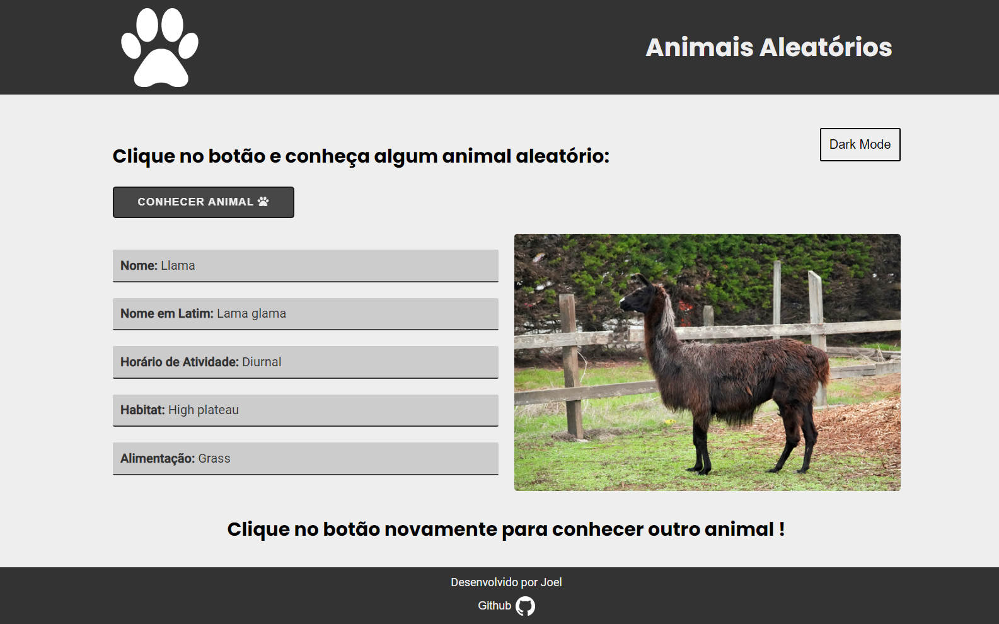
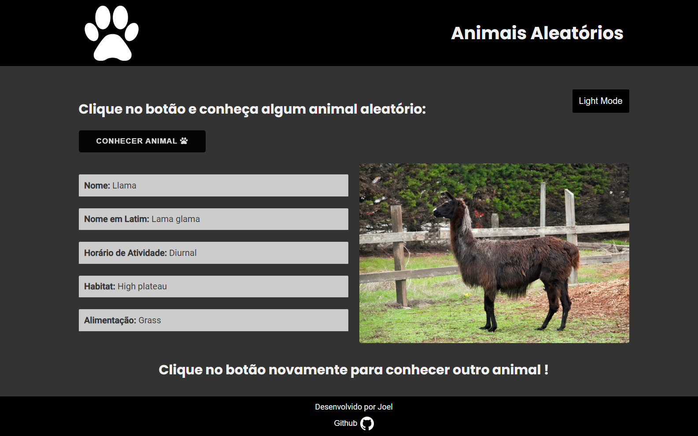
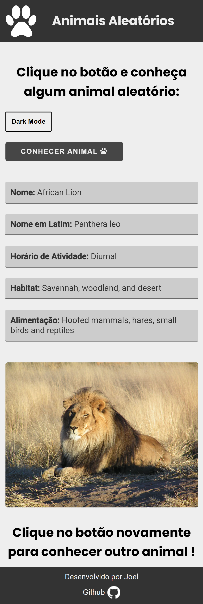

# Curiosidades sobre animais aleatórios  🦁

Esse mini projeto foi feito apenas para por em prática o consumo de API e a utilização de FETCH, é um projeto bem simples mas decidi subir ele pro GitHub.
  
 O projeto puxa os dados sobre animais de uma API e exibe na tela, exemplo: nome, habitat, uma foto do animal e etc.
  

 Também está responsivo e com **Light/Dark MODE.**

 Light Mode 
 
   
 Dark Mode
 
   
 Mobile
  

  Ou você também pode visitar ele pelo link: 
  <a href="https://joeljsilva.github.io/animais-aleatorios/" target="_blank">Clique aqui para conhecer</a>